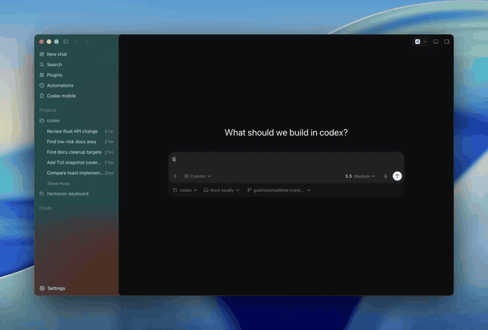

# Codex Managed Worktree Threads

[](https://skills.sh/daxiong888/codex-managed-worktree-threads)

Codex App-only skill for coordinating one Codex App background thread per write implementation task in Codex-managed worktrees.

This skill is intentionally explicit-only: invoke it as `$codex-managed-worktree-threads` when you want Codex to coordinate parallel implementation tasks through Codex App-managed background threads and worktrees.

## Official Demo

OpenAI's Codex team showed the same core workflow: Codex can manage Codex threads, search and organize conversations, pin important ones, and spin up worktrees for parallel tasks.

[](https://x.com/guinnesschen/status/2060464235868836235)

- Promo post: [Guinness Chen on X](https://x.com/guinnesschen/status/2060464235868836235)

## Install

Install globally for Codex:

```bash
npx skills add daxiong888/codex-managed-worktree-threads -a codex -g
```

Preview the skill before installing:

```bash
npx skills add daxiong888/codex-managed-worktree-threads --list
```

## Compatibility

Requires Codex App background-thread tools discoverable through `tool_search`.

This skill is not intended for CLI-only sessions, IDE-only sessions, manual `git worktree` workflows, tmux orchestration, or Codex CLI worker orchestration.

Optional model and reasoning routing is used only when the available Codex App thread tools expose those controls. If selectors are not exposed, the skill records model/reasoning preferences in the child prompt instead of claiming a hard setting.

## Groundwork flow

A recommended workflow is:

1. Use Groundwork `to-prd` to create the PRD.
2. Use Groundwork `to-issues` to split the PRD into independently implementable and verifiable issues.
3. Invoke `$codex-managed-worktree-threads` and provide the PRD plus generated issues.
4. Let this skill classify the issues:
   - write implementation issues become Codex App background threads with Codex-managed worktrees;
   - each eligible write issue is treated as the child thread's goal;
   - read-only review, multi-perspective critique, planning, scoring, and triage tasks do not get worktrees.
5. Review each child thread's review package before merge sequencing.

The main thread remains the coordinator. Goal Mode instructions are inserted only into child-thread prompts, so the coordinator does not accidentally start Goal Mode in the current conversation.

## Task routing

The skill now classifies each task before creating any background thread:

| Task type | Worktree thread? | Examples |
|---|---:|---|
| `write_implementation` | Yes | feature issue, bug fix, tests, migration, repo docs/config updates |
| `read_only_review` | No | multi-perspective review, architecture critique, security review, PRD review |
| `planning_only` | No | issue triage, decomposition, implementation plan without edits |
| `hybrid` | Split first | investigation plus likely code edits |

This prevents worktree creation for read-only scenarios while preserving parallel implementation for issues that can be independently implemented and validated.

## Model and thinking routing

Each write task gets an execution profile before thread creation:

- model profile or concrete model, when supplied by the user or exposed by tooling;
- reasoning effort, such as low, medium, or high, when supported;
- cost/latency bias: fast, balanced, or quality;
- one-sentence routing reason.

Small localized tasks default toward faster/lower-cost profiles, normal feature issues default to balanced profiles, and cross-cutting or high-risk tasks default to stronger reasoning profiles.

## Usage

Invoke the skill explicitly:

```text
$codex-managed-worktree-threads
```

Then provide the task matrix, source-of-truth locations, acceptance criteria, and validation signals for each candidate task. For Groundwork-based projects, provide the PRD and the generated issues.

Before creating child threads, the skill must show a routing matrix that includes task type, whether a worktree will be created, child Goal Mode status, execution profile, conflicts, acceptance criteria, and validation signal.

## Files

- `SKILL.md`: skill entry point and operating workflow.
- `agents/openai.yaml`: Codex UI metadata and explicit-invocation policy.
- `references/thread-prompt-template.md`: child-thread prompt template with per-issue Goal Mode and execution profile fields.
- `references/review-package-template.md`: child-thread review package contract.
- `references/rationale.md`: design rationale and boundary references.
